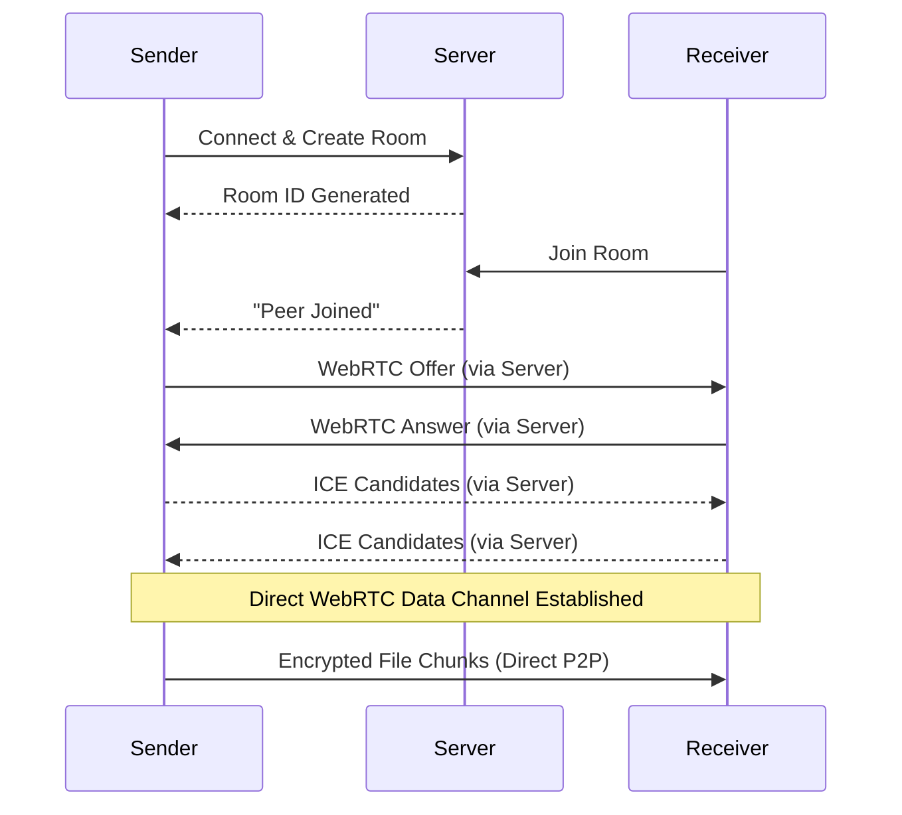
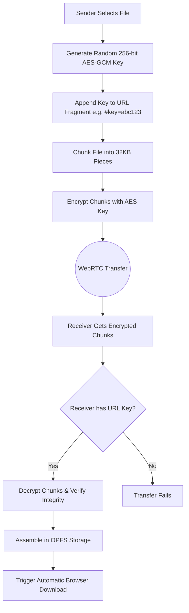

# Peer-to-Peer Web Share 🚀

[](https://next-p2p-swarm.onrender.com/)
[](https://www.youtube.com/watch?v=stsHylMrVIQ)

A modern, fast, and completely secure peer-to-peer file sharing web application. Built with Next.js, WebRTC, and Socket.io. Files are transferred directly between devices using WebRTC Data Channels, ensuring maximum privacy and speed without relying on a central server to store the files.

**[Watch the YouTube Demonstration](https://www.youtube.com/watch?v=stsHylMrVIQ)** | **[Try the Live Website](https://next-p2p-swarm.onrender.com/)**

---

## Features ✨

### Core Features
- **True P2P Transfers**: Files go directly from sender to receiver. There is no middleman cloud storage.
- **End-to-End Encryption**: Zero-knowledge encryption using AES-GCM. The server never sees your keys or files because the decryption key is only stored in the URL fragment (`#key=...`).
- **Large File Support**: Files are sliced into 32KB chunks and streamed over the network to prevent browser memory crashes.
- **Auto-Download**: Files automatically trigger a browser download the moment they hit 100%.
- **Multiple Files**: Users can share and receive multiple files seamlessly within the same secure room.
- **Dark/Light Mode**: Full theme support with a beautiful, fully responsive UI built on Tailwind CSS.

### Advanced Features (Swarm & Storage)
- **Swarm Downloading (BitTorrent-style)**: If multiple peers are in the same room, the receiver can download different file chunks simultaneously from different peers, significantly speeding up the transfer.
- **Resumable Transfers**: Automatic pausing and resuming. If a peer briefly disconnects or the network drops, the transfer pauses and resumes exactly where it left off when reconnected.
- **OPFS (Origin Private File System)**: Leverages modern browser storage APIs to safely handle multi-gigabyte files (up to 10GB+) with extreme write speeds. Falls back to IndexedDB for older browsers.
- **Real-Time Analytics**: Live calculation of transfer speeds (MB/s) and estimated time remaining (ETA).

---

## System Architecture 🏗️

The architecture consists of a Next.js frontend, a custom Socket.io signaling server, and WebRTC for the actual data transfer. 

### 1. WebRTC Signaling Flow

To connect two devices directly, they must first exchange connection metadata (ICE candidates and Session Descriptions). We use a lightweight Socket.io server strictly for this initial handshake.



### 2. Encryption & Data Flow

To ensure complete privacy, the files are encrypted *before* they even leave the sender's device. 



---

## How It Works 🛠️

1. **Room Creation:** When a user selects a file, a unique room ID and a random 256-bit AES encryption key are generated locally on the device.
2. **Signaling:** The WebRTC connection requires initial "signaling" (exchanging IP addresses and connection parameters). We use a lightweight custom Socket.io server to pass these signals.
3. **Data Channel:** Once the WebRTC connection is established, the devices talk directly to each other. The signaling server is no longer involved in the data transfer and uses 0 bandwidth.
4. **Chunking & Encryption:** Large files are sliced into 32KB chunks, encrypted, and streamed over the network to prevent memory crashes.
5. **Reassembly:** The receiver decrypts the chunks in real-time, verifying their integrity, and writes them to the browser's high-performance OPFS (Origin Private File System). Once complete, the browser automatically saves the file to the user's computer.

---

## Tech Stack 💻

- **Frontend Framework:** Next.js 14 (App Router, React 19)
- **Styling:** Tailwind CSS, Framer Motion, Lucide Icons, shadcn/ui
- **P2P Engine:** WebRTC (`simple-peer`)
- **Signaling Server:** Socket.io (Node.js Custom Server)
- **Storage:** IndexedDB / Origin Private File System (OPFS)
- **Cryptography:** Web Crypto API (AES-GCM)

---

## Getting Started 🚀

### Prerequisites
- Node.js 18+
- npm, yarn, or pnpm

### Installation

1. Clone the repository:
```bash
git clone https://github.com/Arindam229/next-p2p-swarm.git
cd next-p2p-swarm
```

2. Install dependencies:
```bash
npm install
```

3. Run the development server:
```bash
npm run dev
```

4. Open [http://localhost:3000](http://localhost:3000) with your browser to see the result. You can open two tabs to test the file transfer locally.

---

## Deployment 🌍

Because this app utilizes WebSockets for signaling, it requires a persistent custom Node.js server. It cannot be deployed purely statically or on standard serverless environments (like standard Vercel serverless functions) that terminate WebSocket connections early.

It is highly recommended to deploy on platforms like **Render**, **Railway**, or **Heroku**.

```bash
npm run build
npm start
```
